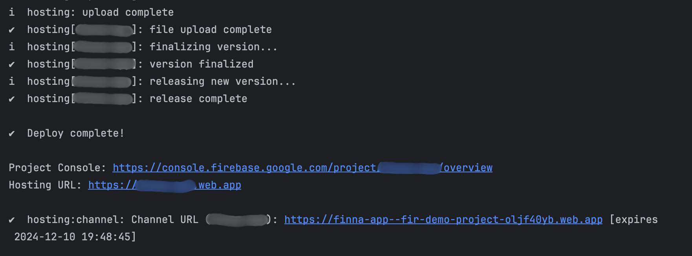

# Allure Docker Deploy
***Test locally, report globally.***

This [Docker image](https://hub.docker.com/r/sokari/allure-docker-deploy) is for testers who test locally but want to store and share their [Allure](https://allurereport.org/) test reports in the cloud. With minimal setup, this image enables local test results to be uploaded to a cloud storage bucket, generate a hosted Allure report, and share it via a [Firebase-hosted website](https://firebase.google.com/docs/hosting).

---

## Key Features
- **Cloud Storage Integration**: Save Allure test results and history in a Google Cloud Storage bucket.
- **Firebase Hosting**: Auto generate and host Allure reports on a website for easy sharing with stakeholders.
- **TTL-Optimized Deployment**: Configurable delay before deployment to ensure all test results are finalized.

---

## Requirements
1. **Google Cloud Credentials**:
    - Set up a Google Cloud [service account](https://firebase.google.com/docs/admin/setup#initialize_the_sdk_in_non-google_environments) with access to your storage bucket and Firebase Hosting.
    - Download the `service-account-file.json` JSON file that the `GOOGLE_APPLICATION_CREDENTIALS` env will point to.

2. **Google Cloud Storage Bucket**:
    - A storage bucket to store test results and reports.

3. **Website ID**:
    - A unique identifier for your hosted report website in Firebase (for example, feature_mission-2-mars).

---

## Environment Variables

| Variable                         | Description                                                                                             | Default          |
|----------------------------------|---------------------------------------------------------------------------------------------------------|------------------|
| `GOOGLE_APPLICATION_CREDENTIALS` | Path to the GCP service account JSON file (required).                                                   | None             |
| `STORAGE_BUCKET`                 | Google Cloud Storage bucket name (required if using cloud storage).                                     | None             |
| `WEBSITE_ID`                     | A unique identifier of your choice  (required if using Firebase Hosting).                               | None             |
| `TTL_SECS`                       | Time to wait (in seconds) after last file is detected before generating and uploading the report. | 45               |

**Note**: `STORAGE_BUCKET` or `WEBSITE_ID` must be provided. Both can be configured if you want to enable all functionalities.

---

## How It Works

1. Mount your test results directory (`/allure-results`) to the container.
2. Configure required environment variables:
   - `GOOGLE_APPLICATION_CREDENTIALS`: Path to your GCP credentials file.
   - `STORAGE_BUCKET`: The name of your Google Cloud Storage bucket (if using cloud storage).
   - `WEBSITE_ID`: A unique identifier for the Firebase Hosting site. This ID will be used to construct the URL for the test report website. (if using Firebase Hosting).
3. Optionally, configure:
   - `TTL_SECS`: The number of seconds to wait before deploying a report after the last file is detected (default: 45 seconds).
4. The container will watch for updates in the `/allure-results` directory. Once no new files are detected within the `TTL_SECS` timeframe, it will:
   - Upload results to the specified Google Cloud Storage bucket (if `STORAGE_BUCKET` is provided).
   - Host the generated Allure report on Firebase Hosting (if `WEBSITE_ID` is provided).
   - Perform both actions if both environment variables are set.
5. [Report history and retries](https://allurereport.org/docs/history-and-retries/#history-and-retries) are auto enabled as `allure-report/history` directory is saved in storage after report generation.
6. Your hosted Allure Report website is powered by Firebase hosting [preview channel](https://firebase.google.com/docs/hosting/test-preview-deploy?hl=en&authuser=0#preview-channels) which is ephemeral with a 7 days expiry by default. It can be adjusted with a `WEBSITE_EXPIRES` env variable in the docker run command or docker-compose file. Use `h` for hours, `d` for days, and `w` for weeks (for example, `12h`, `7d`, `2w`, respectively). Max duration is 30 days.


---

## Getting Started

### Step 1: Pull the Docker Image
```bash
docker pull sokari/allure-docker-deploy:latest
```

### Step 2: Run the Container
```shell
docker run -d \
  -e GOOGLE_APPLICATION_CREDENTIALS=/credentials/gcp-key.json \
  -e STORAGE_BUCKET=my-test-results-bucket \
  -e TTL_SECS=60 \
  -e WEBSITE_ID=my-custom-site-id \
  -e WEBSITE_EXPIRES=2d \
  -v /path/to/allure-results:/allure-results \
  -v /path/to/gcp-key.json:/credentials/gcp-key.json \
  sokari/allure-docker-deploy
```
Docker compose example:
```yaml
services:  
  allure:
    image: sokari/allure-docker-deploy
    container_name: deploy-service
    volumes:
      - /path/to/allure-results:/allure-results
      - /path/to/service-account.json:/service-account.json
    environment:
      GOOGLE_APPLICATION_CREDENTIALS: /service-account.json
      STORAGE_BUCKET: your-storage-bucket
      # Uncomment the line below to enable Firebase Hosting
      # WEBSITE_ID: your-firebase-site-id
      # WEBSITE_EXPIRES: 2d
      TTL_SECS: 60
```

### Step 3: View the hosted Allure Report

After the report is generated, the URL to your hosted report will be output in the logs as `hosting:channel: Channel URL`. Share it with your team!

<div style="text-align: left"></div>

You can also find the website URL in your Firebase Console Dashboard.

## Example Use Case

	1.	Run your tests locally.
	2.	Output test results to /allure-results.
	3.	The container detects updates and uploads results to Google Cloud Storage.
	4.	Once the test run is complete, an Allure report is generated and hosted on Firebase.
	5.	Share the report URL with stakeholders for review.


License

This project is licensed under the [MIT License](https://opensource.org/licenses/MIT). See the LICENSE file for details.

Contributing

Contributions are welcome! Feel free to open issues or submit pull requests for bug fixes or new features.