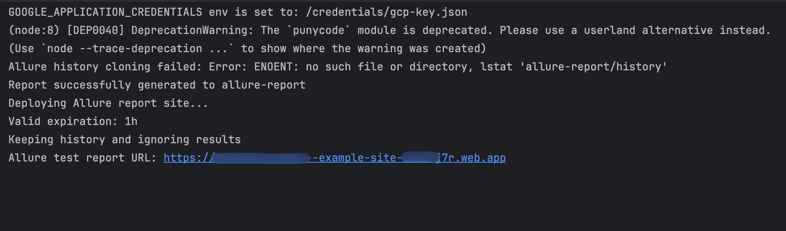

# Allure Docker Deploy
_A simple way to share and backup `allure` test reports._

This [Docker image](https://hub.docker.com/r/sokari/allure-docker-deploy) will enable you to share [Allure test reports](https://allurereport.org/) seamlessly with stakeholders via an ephemeral URL and backup all file  History and Retries in Firebase Cloud Storage. You can generate unique URLs for each test run, allowing you to preview previous test run reports after generating a new report.
It works in both CI and local environments, requiring minimal setup. The generated URLs are hosted with [Firebase-hosted website](https://firebase.google.com/docs/hosting), and a free tier Firebase plan is all you need to get started.


---

## Key Features
- **Cloud Storage**: Save Allure test results and history in a Google Cloud Storage bucket.
- **Test Report preview URL**: Generates and hosts Allure reports on a website for easy sharing with stakeholders, powered by Firebase Hosting
- **Slack notification** Review Test report preview URL in Slack after every test run (Coming soon)
- **Watch Mode**: Continuously detects test results and takes action (backup to storage and publish report website): Only enable this when running this image locally.
---

## Use cases
### GitHub Actions
```yaml
name: Allure Docker Deploy
on:
  push:
    branches:
      - main
jobs:
  test-and-report:
    runs-on: ubuntu-latest
    steps:
    - uses: actions/checkout@v3
    - name: Run Tests
      run: |
        # Run your tests and output results to a directory
        mkdir -p ./allure-results
    - name: Authenticate Docker Hub
    - uses: docker/login-action@v3
      with:
        username: ${{ secrets.DOCKERHUB_USERNAME }}
        password: ${{ secrets.DOCKERHUB_TOKEN }}
        
    - name: Allure Docker Deploy to Firebase
      run: |
        docker run --rm \
        -e GOOGLE_APPLICATION_CREDENTIALS=/credentials/gcp-key.json \
        -e STORAGE_BUCKET=my-test-results-bucket \
#        -e WEBSITE_ID=my-custom-site-id \
        -e WEBSITE_ID=${{ github.ref }} \
        -e WEBSITE_EXPIRES=3d \
        -e KEEP_HISTORY=true \
        -e KEEP_RETRIES=true \
        -e GITHUB=true
        -v ${{ github.workspace }}/allure-results:/allure-results \
        -v ${{ secrets.GCP_CREDENTIALS_FILE_PATH }}:/credentials/gcp-key.json \
        sokari/allure-docker-deploy:latest
            
```
Tips:
1. Use a different value `WEBSITE_ID` in every test run. `${{ github.ref }}` is a good example. 
2. Set the WEBSITE_EXPIRES value appropriately to deallocate old test run sites. 
### Local test runs
#### Step 1: Pull the Docker Image
```bash
docker pull sokari/allure-docker-deploy:latest
```
#### Step 2: Run the Container
```shell
docker run -d \
  -e GOOGLE_APPLICATION_CREDENTIALS=/credentials/gcp-key.json \
  -e STORAGE_BUCKET=my-test-results-bucket \
  -e WEBSITE_ID=my-custom-site-id \
  -e WEBSITE_EXPIRES=2d \
  -e WATCH_MODE=true \
  -e TTL_SECS=60 \
  -v /path/to/allure-results:/allure-results \
  -v /path/to/gcp-key.json:/credentials/gcp-key.json \
  sokari/allure-docker-deploy
```
With `docker-compose.yaml`:
```yaml
services:  
  allure:
    image: sokari/allure-docker-deploy
    container_name: deploy-service
    volumes:
      - /path/to/allure-results:/allure-results
      - /path/to/service-account.json:/service-account.json
    environment:
      GOOGLE_APPLICATION_CREDENTIALS: /service-account.json
      STORAGE_BUCKET: your-storage-bucket
      KEEP_HISTORY: true # Default is true when STORAGE_BUCKET is provided
      KEEP_RETRIES: false # Default is false
      # Uncomment the line below to enable Hosting
      # WEBSITE_ID: your-firebase-site-id
      # WEBSITE_EXPIRES: 2d
      WATCH_MODE: true
      TTL_SECS: 60
```


## Requirements
1. **Google Cloud Credentials**:
   - Set up a Google Cloud [service account](https://firebase.google.com/docs/admin/setup#initialize_the_sdk_in_non-google_environments) with access to your storage bucket and Firebase Hosting.
   - Download the `service-account-file.json` JSON file that the `GOOGLE_APPLICATION_CREDENTIALS` environment variable will point to.

2. **Google Cloud Storage Bucket**:
   - A storage bucket to store test results and reports.

3. **Website ID**:
   - A unique identifier for your hosted report website in Firebase (for example, `feature_mission-2-jupiter`).

---

## Environment Variables

| Variable                         | Description                                                                                                                         | Default |
|----------------------------------|-------------------------------------------------------------------------------------------------------------------------------------|---------|
| `GOOGLE_APPLICATION_CREDENTIALS` | Path to the GCP service account JSON file (required).                                                                               | None    |
| `STORAGE_BUCKET`                 | Google Cloud Storage bucket name (required if using cloud storage).                                                                 | None    |
| `WEBSITE_ID`                     | A unique identifier of your choice to identify the Test Report website.                                                             | None    |
| `WEBSITE_EXPIRES`                | Duration before the generated website is disabled. Can be between an hour to 30 days. Examples: 1h, 2d, 3w                          | 7d      |
| `KEEP_HISTORY`                   | Backup `reports/history` directory after report generation                                                                          | true    |
| `KEEP_RETRIES`                   | Backup files in the `allure-results` directory after report generation                                                              | false   |
| `WATCH_MODE`                     | Keep the container running to auto deploy new test reports and results                                                              | false   |
| `TTL_SECS`                       | Time to wait (in seconds) after last file is detected before generating and uploading the report. Only works when `WATCH_MODE=true` | 45      |

**Note**: Either `STORAGE_BUCKET` or `WEBSITE_ID` must be provided. Both can be configured if you want to enable all functionalities.

---


## How it works

1. Mount your test results directory (`/allure-results`) to the container.
2. Configure required environment variables:
   - `GOOGLE_APPLICATION_CREDENTIALS`: Path to your GCP credentials file.
   - `STORAGE_BUCKET`: The name of your Google Cloud Storage bucket (if using cloud storage).
   - `WEBSITE_ID`: A unique identifier for the Firebase Hosting site. You can use different identifiers to get a new website for every test run. Using the same `WEBSITE_ID` for multiple runs will replace the previous Test Report on the previously generated URL
3. When `WATCH_MODE` is set to `true`, the container will watch for updates in the `/allure-results` directory. Once no new files are detected within the `TTL_SECS` timeframe, it will:
   - Upload results to the specified Google Cloud Storage bucket (if `STORAGE_BUCKET` is provided).
   - Host the generated Allure report on Firebase Hosting (if `WEBSITE_ID` is provided).
   - Perform both actions if both environment variables are set.
4. Optionally configure `TTL_SECS` (default: 45 seconds) when running in `WATCH_MODE` to delay the active functionalities (Hosting/Storage) as Allure result files are being added to the `/allure-results`. On every new file detected, the `TTL_SECS` restarts the countdown toward deployment/storage. Report generation, deployment, and storage begin if no new file is detected after the `TTL_SECS`.
5. [Report history and retries](https://allurereport.org/docs/history-and-retries/#history-and-retries) are auto-enabled as `allure-report/history` directory is saved in storage after report generation.
6. The autogenerated Allure Report website is powered by Firebase hosting [preview channel](https://firebase.google.com/docs/hosting/test-preview-deploy?hl=en&authuser=0#preview-channels) which is ephemeral with a 7 days expiry by default. You can adjust the duration with the `WEBSITE_EXPIRES` environment variable in the docker run command or docker-compose file. Use `h` for hours, `d` for days, and `w` for weeks (for example, `12h`, `7d`, `2w`, respectively). The max duration is 30 days.

_Note: While you can use Firebase hosting for free, you need to enable billing to use Cloud Storage.
Nevertheless, you have free 5GB of storage before you will incur any charges_

---

## Where to find your hosted test report URL
| Platform  | Report URL output location          |
|-----------|-------------------------------------|
| GitHub    | Logs, Firebase console, Slack (WIP) |
| Gitlab    | Logs, Firebase console, Slack (WIP) |
| Localhost | Logs, Firebase console              |
### URL in logs example
<div style="text-align: left"></div>

_You can also find the URL in your Firebase Console Dashboard._

## Comparison: Docker Deploy vs Allure GitHub Actions Integration

| Feature                                   | Allure Docker Deploy                                                                                            | [Allure GitHub Actions Integration](https://allurereport.org/docs/integrations-github/#github-actions-integration) |
|-------------------------------------------|-----------------------------------------------------------------------------------------------------------------|--------------------------------------------------------------------------------------------------------------------|
| **Unique URLs for each deployment**       | Yes, every deployment generates a unique ephemeral URL for the test report.                                     | No, reports are deployed to a single GitHub Pages URL, overwriting previous reports.                               |
| **Report history and retries**            | Keeps complete history and retries by saving test result files to Cloud Storage for future report generations.  | No retires, only report history retrieved from the previous GitHub Pages deployment.                               |
| **Cloud Storage backup**                  | Automatically backs up test result files to Google Cloud Storage.                                               | No backup functionality; relies on GitHub repositories for report storage.                                         |
| **Direct deployment without Git commits** | Deploys directly to Firebase Hosting without committing generated reports to Git.                               | Requires committing generated reports to GitHub Pages.                                                             |
| **Further analysis capabilities**         | Allows access to all saved test result files for additional analysis beyond the Allure-generated report.        | No such functionality provided.                                                                                    |
| **Slack notifications**                   | Planned (coming soon).                                                                                          | Not supported.                                                                                                     |
| **Hosting platform**                      | Firebase Hosting, with ephemeral URLs that can be customized and set to expire (default: 7 days, max: 30 days). | GitHub Pages, with a persistent single URL.                                                                        |


---

## License

This project is licensed under the [MIT License](https://opensource.org/licenses/MIT). See the LICENSE file for details.

Contributing

Contributions are welcome! Feel free to open issues or submit pull requests for bug fixes or new features.